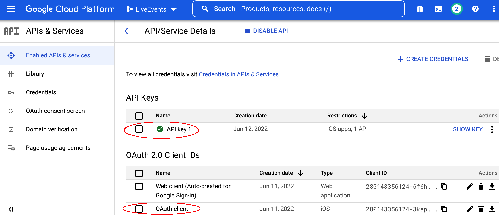

# YTLiveStreaming

YTLiveStreaming is an open source iOS framework to create live broadcasts and video streams on YouTube using YouTube Live Streaming API
(YouTube Data API v3)

## Requirements

- Xcode 13+
- Swift 5.0

## Introduction

- First of all enable YouTube LIVE on your account.
- Go to your Google account https://console.developers.google.com
- Create a new application.
- Go to the new application
- Select Library
- Select "YouTube Data API v3"
- Select Credentials
- Create Api key (API_KEY) ; In Key restriction select iOS, enter your iOS app bundle id; Save
- Create Oauth 2.0 Cient ID (CLIENT_ID)

- add three scopes for Google APIs: "https://www.googleapis.com/auth/youtube", "https://www.googleapis.com/auth/youtube.readonly",  "https://www.googleapis.com/auth/youtube.force-ssl"


- fill Application Homepage link and Application Privacy Policy link. Submit for verification

- as result you will have API_KEY and CLIENT_ID which will be used in Config.plist your iOS app later.



## Installation

### CocoaPods

[CocoaPods](http://cocoapods.org) is a dependency manager for Cocoa projects. You can install it with the following command:

```bash
$ gem install cocoapods
```

> CocoaPods 1.1.0+ is required to build YTLiveStreaming

To integrate YTLiveStreaming into your Xcode project using CocoaPods, specify it in your `Podfile`:

```ruby
source 'https://github.com/CocoaPods/Specs.git'
platform :ios, '13.0'
use_frameworks!

target '<Your Target Name>' do
    pod 'YTLiveStreaming'
end
```

Then, run the following command:

```bash
$ pod install
```

### Swift Package Manager

To integrate YTLiveStreaming package using Apple's Swift package manager
- open your Xcode project
- select File - Add packages...
- in the Apple Swift Packages screen select 'Search or Enter Package URL'
- enter https://github.com/SKrotkih/YTLiveStreaming.git
- make sure YTLiveStreaming is opened
- press 'Add Package' 
- Xcode creates 'Package Pependencies' group with YTLiveStreaming package with last version 
- open your Xcode project settings - PROJECT section on the Package Dependencies tab
- make sure the YTLiveStreaming package name is presented there 

## User guide

	import YTLiveStreaming

	...

	let input: YTLiveStreaming = YTLiveStreaming

	...

	// Get all events in different arrays of the LiveBroadcastStreamModel type
	input.getAllBroadcasts(){ (upcomingEvents, liveNowEvents, completedEvents) in
	   ...
	}

	// Get events separately:

	// Get Ready to broadcast events
	input.getUpcomingBroadcasts() { result in
          switch result {
              case .success(let upcomingEvents):
                ...
              case .failure(let error):
                ...
          }    
	} 

	// Get Live now broadcasts
	input.getLiveNowBroadcasts() ( result in
          switch result {
              case .success(let  liveNowEvents):
                  ...
              case .failure(let error):
                  ...
          }
	} 

	// Get Completed broadcasts
	input.getCompletedBroadcasts() ( result in
             switch result {
                 case .success(let completedEvents):
                     ...
                 case .failure(let error):
                     ...
             }
       } 

	// Create Broadcast
	input.createBroadcast(title, description: description, startTime: startDate, completion: { liveBroadcast in
	   if let liveBroadcast = liveBroadcast {
	      ...
	   }
	})

	// Update of the existing broadcast: LiveBroadcastStreamModel
	input.updateBroadcast(broadcast, completion: { success in
	    if success {
	       ...
	    }      
	})

	// Start broadcast streaming video
	input.startBroadcast(broadcast, delegate: self, completion: { streamName, streamUrl, _ in
	   if let streamName = streamName, let streamUrl = streamUrl {
	     completion(streamUrl, streamName)
	   }
	})

	// Finish broadcast streaming video
	input.completeBroadcast(broadcast, completion: { success in
	   if success {
	      ...
	   }
	})

	// Delete broadcast video from YouTube
	input.deleteBroadcast(id: broadcastId, completion: { success in
	    if success {
	       ...
	    }
	})
	

And some other public methods of the YTLiveStreaming class  

## Example of using YTLiveStreaming Framework

[LiveEvents](https://github.com/SKrotkih/LiveEvents) is an example of using the framework 

## Libraries Used

- SwiftyJSON
- Moya
- KeychainAccess

Note. Here were  used the following things:
- Podspec ( https://guides.cocoapods.org/syntax/podspec.html )
- Swiftlint
- Xcode unit tests
- Objective-C + Swift code example

The project was created
11-11-2016

Changes history:
25-07-2022 
- build 0.2.27
16-07-2022
- build 0.2.26
- package.swift was added
08-07-2022 Add ability to integrate the framework as a package
29-06-2022 Example project (LiveEvents) was removed from the project into a separate repo
14-06-2022
 - added Combine based method apart from RxSwift publisher subject to handle Google Sign-in results;
 - updated Google Sign-In according actual framework version;
 - implemented Google SignIn screen with using SwiftUI.
18-05-2021
- added SwuftUI based content view for the YouTube video player 
04-05-2021
- added youtube-ios-player-helper as an video player
- added Xcode unit test 
 15-03-2021
- added Swiftlint 
- fixed Swiftlint warnings
- Sample app was renamed to LiveEvents
29-04-2020 
 -  build 0.2.17
 - Sample app was redesigned
 -  GoogleSignIn (used in the Sample app): up to 5.0.2
